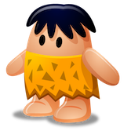
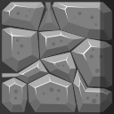
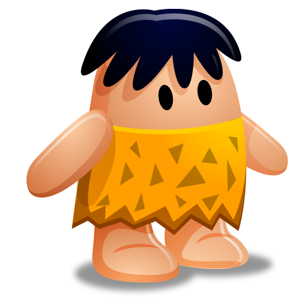
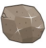
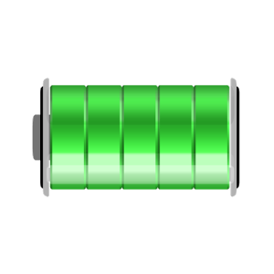
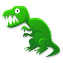
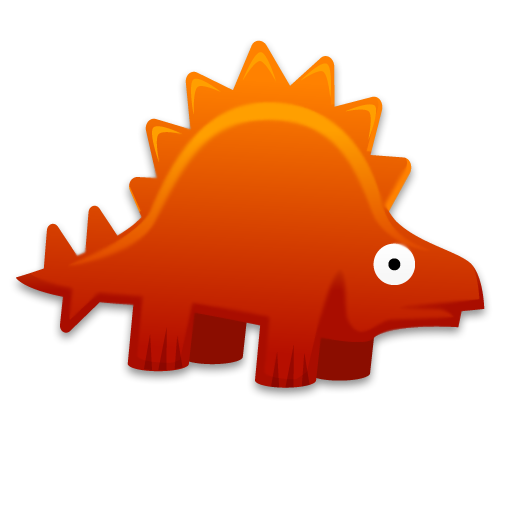
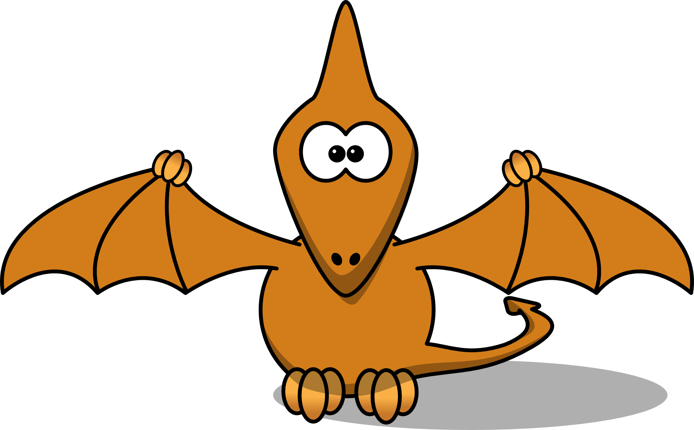

[](https://opensource.org/licenses/MIT)
# Mazeman-Game 

Mazeman-Game is an iOS game built using SpriteKit. The game has two scenes: the main game scene and the game over scene. 


## How to Play

1. The game is designed to run only on the iPad in landscape left and right modes. Make sure your device is in one of these modes before launching the game.

2. The game starts with blocks (obstacles)  only at the bottom (one row) and top part (two rows) of the screen. The button row includes two water blocks (which are static locations).

3. The player's initial location is at the lower-left corner of the screen, facing right. To move the player , swipe in any of the four main directions (up, down, left, or right) using your finger. The player will move in the direction of your swipe until it hits an object or the edge of the screen. The movement direction can also change at any time with a new swipe gesture in another direction.

4. As the game progresses, a block is added every 1 second until 15 (maxBlockCount) blocks are added. To shoot rocks  at enemies, tap on the screen in the direction you want to shoot. The rock will be thrown towards that point, and if it hits an enemy, the enemy will be killed. The player's initial rock count is set to 10. Every time it shoots, it loses one rock. The only way of earning new rocks is by time (every 30 sec). The max rock count is set to 20, and the player cannot earn more than this.

5. Enemies will appear in the game scene, and they can go through blocks. Their damage to the player's health (energy) is different. To kill an enemy, throw a rock at it by tapping on the screen in its direction. A new instance of a killed enemy type reappears (after dying) after a randomly selected time in the range [1-5] sec. All enemies move slightly faster than the player. Avoid enemies and water blocks . If you touch an enemy or fall into the water, you'll lose energy  and hearts .

6. Food  is scattered randomly throughout the game scene, and each piece of food has a value of 50 energy. When the player contacts food, it gains the corresponding amount of energy. The food is generated every 5-10 seconds, and a maximum of 5 food pieces can exist at any given time. If the player's energy is full (100), the food will not add any additional energy.

7. A star  is also present in the game scene, and when the player contacts it, it gains 100 energy. However, the star is only present for a limited time, and once it disappears, it does not reappear again in the game. The player can earn additional points by collecting the star.

8. The player has 3 additional lives (hearts) initially, and every time its energy becomes zero, it loses one heart. The player's energy is 100, and it loses 1 energy every second. It can gain energy by eating food (50 energy), and it loses energy if it contacts enemies. As the player can have a maximum of 3 additional hearts, including its own energy, this will be equal to max 400 energy. When energy hits zero, one heart is used to reset energy to 100. The player dies either when it loses all hearts and energy or drowns in water (immediate death). No gravity is effective initially, but it is enabled after every random time in the range [40-60] seconds and affects only the player. Gravity is effective only 1 second. The player drowns if it falls into water (due to gravity or any time it goes there).

A instance of each enemy type is added to the game at the beginning. Enemies can go through blocks. Their damage to the player's health (energy) is different. They are killed by rocks thrown by the player. A new instance of a killed enemy type reappears (after dying) after a randomly selected time in the range [1-5] sec. All enemies move slightly faster than the player.

#### Enemy Types


1. Dino1 
    * Damage to Player: 60 energy (0.6 heart)
    * Entry Point Behavior: Randomly selected water block in the ground row.
    * Behavior: Goes up and down, then waits randomly 1-3 sec after each up and down. Can go through blocks.



2. Dino2
    * Damage to Player: 80 energy (0.8 heart)
    * Entry Point Behavior: Any row from right (not top two rows, or bottom one row).
    * Behavior: Goes left and right, waits randomly 1-3 seconds after each left and right. Facing direction (left or right) should change accordingly. Can go through blocks.



3. Dino3
    * Damage to Player: 100 energy (1 heart)
    * Entry Point Behavior: Upper left corner (below top two rows), facing right.
    * Behavior: Can go all four directions (left, right, up, and down). Selects a random direction and continues till it hits another object (including blocks), then reselects another direction. Facing direction (left, right, up, down) should change accordingly.
    


4. Dino4
    * Damage to Player: No damage to player. Not affected by rocks (immortal).
    * Entry Point Behavior: Left most point of ceiling row (i.e., second top row with rocks).
    * Behavior: It moves right and left at the ceiling of the game screen, and it can throw fire balls every randomly selected time in range [5-10] sec.
    
    

5. Fireball
    * Damage to Player: 100 energy (1 heart)
    * Entry Point Behavior: From Dino4’s current position.
    * Behavior: Randomly created. It drops down (straight) and goes out of screen. Can go through blocks.

## Installation

To clone and run this repository, you'll need to have Xcode installed on your system. From the terminal, run the following commands:

```
$ git clone https://github.com/huhu72/Mazeman-Game.git
$ cd Mazeman-Game
$ open Mazeman-Game.xcodeproj
```
## License

This project is licensed under the terms of the MIT license. See the [LICENSE](https://github.com/huhu72/senior-design/blob/main/LICENSE) file for details.
